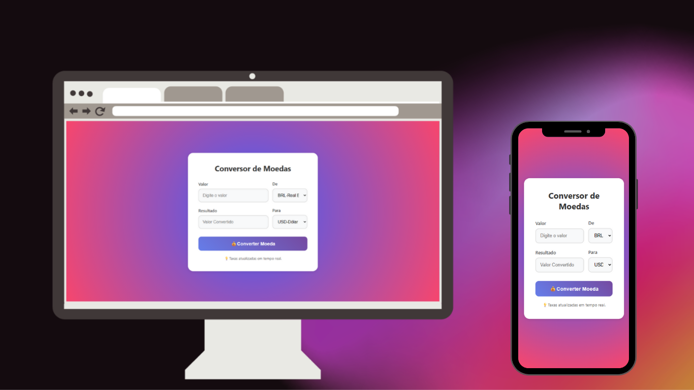

<h1 align="center">Conversor de Moedas💲</h1>
 

Um simples e eficiente aplicativo de conversão de moedas, projetado para fornecer taxas
  de câmbio atualizadas em tempo real e uma interface amigável, tanto para desktop quanto para dispositivos móveis.

 

 

<h2>🚀Funcionalidades:</h2>
 
<ul>
  <li>Conversão de múltiplas moedas em tempo real.</li>
  <li>Interface simples e intuitiva para usuários de todos os níveis.</li>
  <li>Atualizações automáticas das taxas de câmbio.</li>
  <li>Suporte a várias moedas de diferentes países.</li>
</ul>
 
<h2>🔧Tecnologias Utilizadas:</h2>
<ul>
  <li>HTML</li>
  <li>CSS</li>
  <li>JavaScript</li>
  <li>API de Conversão de Moedas: ExchangeRate-API</li>
</ul>

 

<h4>Acesse o aplicativo <a href="https://tatiane-oliveiraa.github.io/Conversor-de-Moedas/">Acessar</a></h4>
